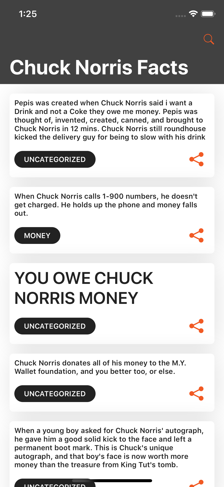
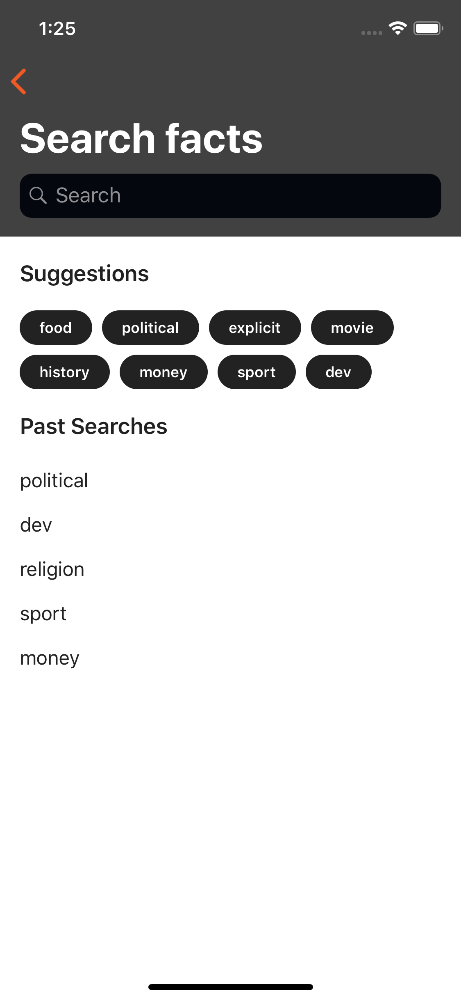
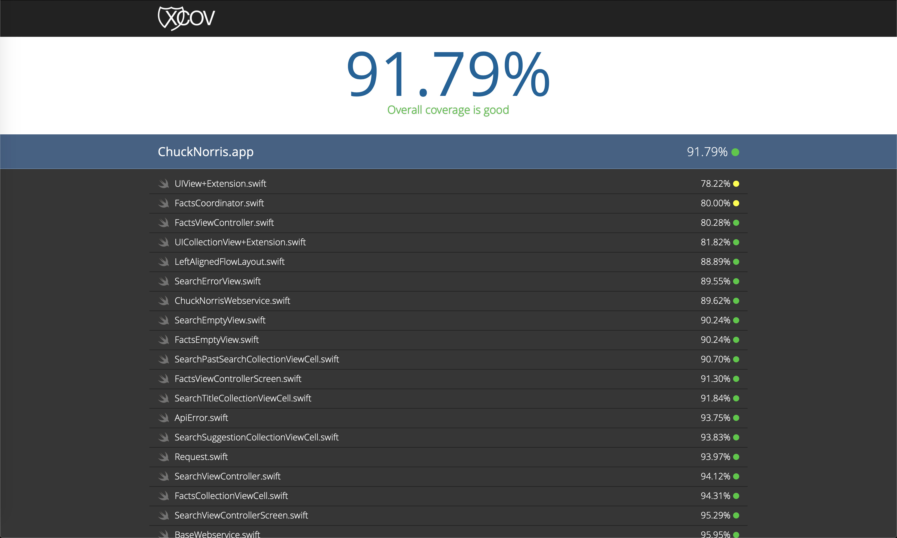

# Chuck Norris App #

Search for all the well known Chuck Norris facts listed by the [Chuck Norris Api](https://api.chucknorris.io)

## Features
- List offline facts previously searched for
- Share a fact with your friends
- Search for a fact or select a suggestion
- Save previous searches offline
- Requests with auto-retry when there is a server error

## Required
- iOS 12.1+ / macOS 10.14.4+
- Xcode 10.2.1+
- Swift 5.0+

## Installation
Open the terminal on the project root

- If Cocoapods is not installed (Please not ruby is required for the gem installation)
```bash
$ sudo gem install cocoapods
```
- Then, install the pods 
```bash
$ pod install
```

## Test Libraries
- [Quick](https://github.com/Quick/Quick) - Quick is a behavior-driven development framework for Swift and Objective-C
- [Nimble](https://github.com/Quick/Nimble) - Use Nimble to express the expected outcomes of Swift or Objective-C expressions
- [MockingJay](https://github.com/kylef/Mockingjay) - An elegant library for stubbing HTTP requests in Swift, allowing you to stub any HTTP/HTTPS using NSURLConnection or NSURLSession
- [KIF](https://github.com/kif-framework/KIF) - Allows for easy automation of iOS apps by leveraging the accessibility attributes that the OS makes available for those with visual disabilities
- [KIF/IdentifierTests](https://github.com/kif-framework/KIF/tree/master/IdentifierTests) - Normally you identify a UI element via its accessibility label so that KIF simulates the interactions of a real user as closely as possible. In some cases, however, you may have to use accessibility identifiers, which are not exposed to users

## Fastlane
- To run the tests
```bash
$ fastlane test
```

- To run the code coverage visualizer
```bash
$ fastlane codecoverage
```

## ScreenShots


